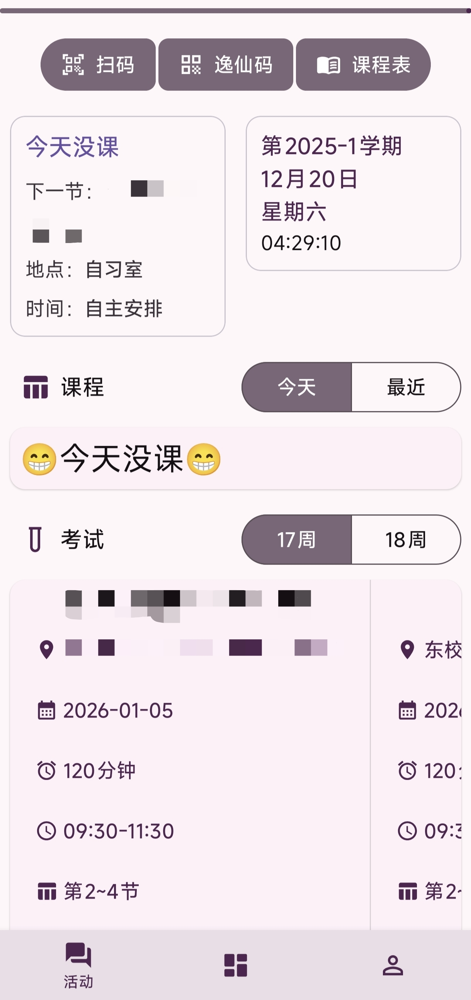
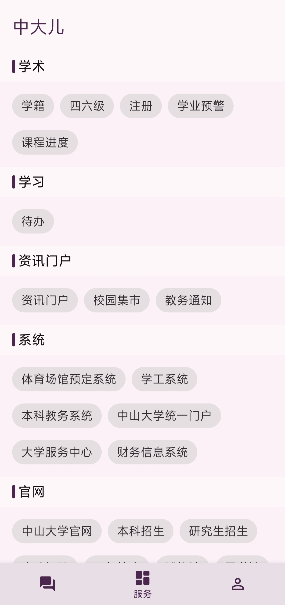

<div align="center">
  <a href="https://github.com/sysu-tang/sysuer">
    
  </a>

  <h1 align="center">Sysuer - 中大人的专属百宝箱</h1>

  <p align="center">
    一款为中山大学 (SYSU) 学子打造的非官方校园生活助手。<br>
    集教务查询、体育锻炼、校园生活与效率工具于一体。
    <br />
    <br />
    <a href="https://github.com/sysu-tang/sysuer/releases">📥 下载 App</a>
    ·
    <a href="https://github.com/sysu-tang/sysuer/issues">🐛 报告 Bug</a>
    ·
    <a href="https://github.com/sysu-tang/sysuer/pulls">✨ 提交 PR</a>
  </p>

  <p align="center">
    
    
    
    
  </p>
</div>

---

## ✨ 项目简介 (Introduction)

**Sysuer** 致力于解决中大同学在校园生活中遇到的痛点。不再需要在教务系统、学工系统和各种网页之间频繁切换，一个
App 即可满足查询课表、查看考试、查看成绩、待办记录以及打开校园卡等高频需求。

项目完全开源，欢迎感兴趣的同学一起参与开发维护！

## 📸 应用预览 (Screenshots)

<div align="center">
  
  
</div>

## 🚀 功能特性 (Features)

### 📚 教务助手

* **课表查询**：同步教务系统课表，~~支持日视图/周视图~~，再也不怕走错教室。
* **成绩管理**：快速查询各学期成绩、绩点 (GPA)。
* **考试安排**：一目了然的考场与考试时间提醒。
* **空闲教室**：随时随地查找自习宝地。
* **选课系统**：暂未开启 ~~支持移动端选课（实验性）~~。
* **评教助手**：支持一键填写、保存、提交评教记录。
* **培养方案**：快捷查看个人培养方案

### 🔗 网页脚本

* **WeLearn刷题**：自动完成WeLearn的题目。
* **心理健康视频速通**：一键修改看视频时长。
* 具体使用方法参考[指南](https://sysu-tang.github.io/#/zh-cn/script)

### 🌈 校园生活

* **校车查询**：各校区校车时刻表查询。
* **校园卡**
  ：支持一键打开微信逸仙卡小程序（详细配置参考[指南](https://sysu-tang.github.io/#/zh-cn/sysu_card)）。
* **资讯聚合**：汇集~~中大新闻与~~教务通知。

### 🛠️ 效率工具

* **待办事项 (Todo)**：内置轻量级 Todo List（半成品），管理学习任务。
* **常用链接**：集成 Library 等常用校园网站入口。

## 🛠️ 技术栈 (Tech Stack)

本项目基于 Android 原生开发：

* **语言**: Java & Kotlin
* **构建**: Gradle Kotlin DSL
* **界面**: Material3Expressive
* **网络**: OkHttp (用于抓取网页数据)
* **解析**: fastjson2
* **架构**: MVVM (部分模块)

## 💻 开发与构建 (Development)

如果你想自己在本地编译代码，建议使用 [Android Studio](https://developer.android.google.cn/studio) 开发：

1. Fork 仓库（在 GitHub 上操作） 或 克隆到本地
```
git clone git@github.com:SYSU-Tang/sysuer.git
cd sysuer
```
2. 配置项目结构

3. 同步Gradle后即可修改代码

4. 构建运行

## 🤝 贡献指南 (Contributing)

非常欢迎 Pull Request！

1. Fork 本仓库。
2. 新建分支 `git checkout -b feature/YourFeature`。
3. 提交代码 `git commit -m 'Add some feature'`。
4. 推送到分支 `git push origin feature/YourFeature`。
5. 提交 Pull Request。

## ⚠️ 免责声明 (Disclaimer)

本项目为中山大学学生个人（或民间团体）开发，**非中山大学官方应用**。

* 应用内所有数据直接来源于学校教务系统，本项目不保存任何用户的账号密码。
* 请仅供学习交流使用，使用本应用产生的任何后果由用户自行承担。

## 📄 开源协议 (License)

Distributed under the MIT License. See `LICENSE` for more information.
