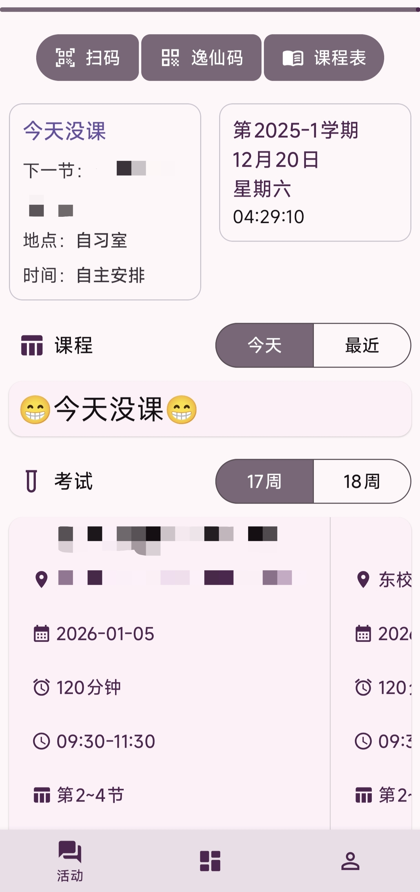
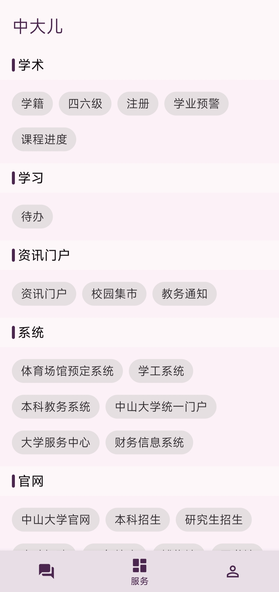

<div align="center">
  <a href="https://github.com/sysu-tang/sysuer">
    
  </a>
  <h1 >Sysuer - 中大人的专属百宝箱</h1>
  <p>
    一款为中山大学 (SYSU) 学子打造的非官方校园生活助手。<br>
    集教务查询、学习平台、校园生活与效率工具于一体。
    <br />
    <br />
    <a href="https://github.com/sysu-tang/sysuer/releases">📥 下载 App</a>
    ·
    <a href="https://github.com/sysu-tang/sysuer/issues">🐛 报告 Bug</a>
    ·
    <a href="https://sysu-tang.github.io/sysuer-website/">🔗 官网</a>
    ·
    <a href="https://github.com/sysu-tang/sysuer/pulls">✨ 提交 PR</a>
  </p>
  <p style="text-align: center;">
    
    
    
    
  </p>
</div>

---

## ✨ 项目简介

**Sysuer** 致力于解决中大同学在校园生活中遇到的痛点。不再需要在教务系统、学工系统和各种网页之间频繁切换，一个
App 即可满足查询课表、查看考试、查看成绩、待办记录以及打开校园卡等高频需求。

项目完全开源，欢迎感兴趣的同学一起参与开发维护！

官方网站：https://sysu-tang.github.io/sysuer-website/

使用指南：https://sysu-tang.github.io/sysuer-website/docs/user/introduction/

开发指南：https://sysu-tang.github.io/sysuer-website/docs/developer/introduction

## 📸 应用预览

<div style="text-align: center;">
  
  
</div>

## 🚀 功能特性

### 📚 教务助手

- **课表查询**：同步教务系统课表，支持周视图，可切换学期和周次，再也不怕走错教室。
- **课程查询**：本学期成功选上的课程，附带详细信息，点击即可查看课程大纲。
- **成绩管理**：快速查询各学期成绩（等级制也可以查看具体分数）、绩点 (GPA)。
- **考试安排**：一目了然的考试科目、考场与考试时间清单。
- **空闲教室**：随时随地查找自习宝地。
- **选课系统**：支持选课、退课、收藏。
- **评教助手**：支持一键填写、保存、提交评教记录。
- **培养方案**：快捷查看个人培养方案。
- **信息查询**：包括全校专业、全校课程、全校培养方案、助教信息、教室占用情况、校历等。

### 🔗 网页脚本

- **WeLearn刷题**：自动完成WeLearn的题目。
- **在线教学平台视频速通**：一键完成在线教学平台视频任务，具体使用方法参考指南。
- **自由复制**：支持在剪贴板中自由复制、粘贴内容。
- **界面美化**：对部分网页进行美化，隐藏不必要的元素。
- **自定义**：支持用户自行编写脚本，实现更多功能。

### 🌈 校园生活

- **校车查询**：各校区校车时刻表查询。
- **校园卡**：支持一键打开微信逸仙卡小程序（详细配置参考指南）。
- **资讯聚合**：汇集中大新闻与教务通知。
- **水电费**：查询宿舍水电费信息，支持缴费。
- **体育场馆**：查询体育场馆信息，支持使用体育时进行预约，暂不支持现金预约。
- **校园网管理**：查询校园网状态，支持暂停、续费校园网。
- **接诉即办**：目前仅实现广场功能
- **校医院查询**：查询南校校医院信息。

### 🛠️ 效率工具

- **待办事项 (Todo)**：内置轻量级 Todo List（半成品），管理学习任务。
- **作业管理**：目前仅支持列出在线教学平台的作业清单。
- **常用链接**：收集常用校园网站入口、资料下载链接。

## 🛠️ 技术栈

本项目基于 Android 原生开发：

* **语言**: Java & Kotlin
* **构建**: Gradle Kotlin DSL
* **界面**: Material3 Design
* **网络**: OkHttp
* **解析**: fastjson2
* **架构**: MVVM (部分模块)

## 💻 开发与构建

如果你想自己在本地编译代码，建议使用 [Android Studio](https://developer.android.google.cn/studio) 开发：

1.Fork 仓库（在 GitHub 上操作） 或 克隆到本地

```
git clone git@github.com:SYSU-Tang/sysuer.git
cd sysuer
```

2.配置项目结构

3.同步Gradle后即可修改代码

4.构建运行

## 🤝 贡献指南

非常欢迎 Pull Request！

1. Fork 本仓库。
2. 新建分支 `git checkout -b feature/YourFeature`。
3. 提交代码 `git commit -m 'Add some feature'`。
4. 推送到分支 `git push origin feature/YourFeature`。
5. 提交 Pull Request。

## ⚠️ 免责声明

本项目为中山大学学生个人开发，**非中山大学官方应用**。

* 应用内所有数据直接来源于学校教务系统，本项目不保存任何用户的账号密码。
* 请仅供学习交流使用，使用本应用产生的任何后果由用户自行承担。

## 📄 开源协议

本项目基于 Apache License 2.0 开源，你可以在遵守协议的前提下自由使用、修改和分发本项目的代码。
